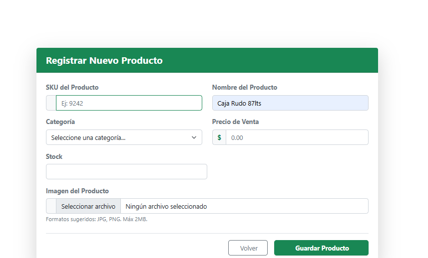
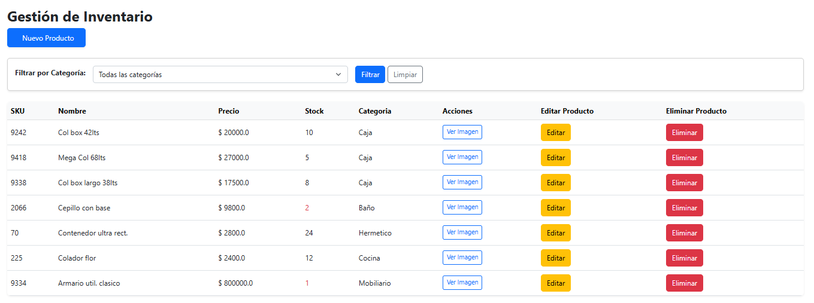
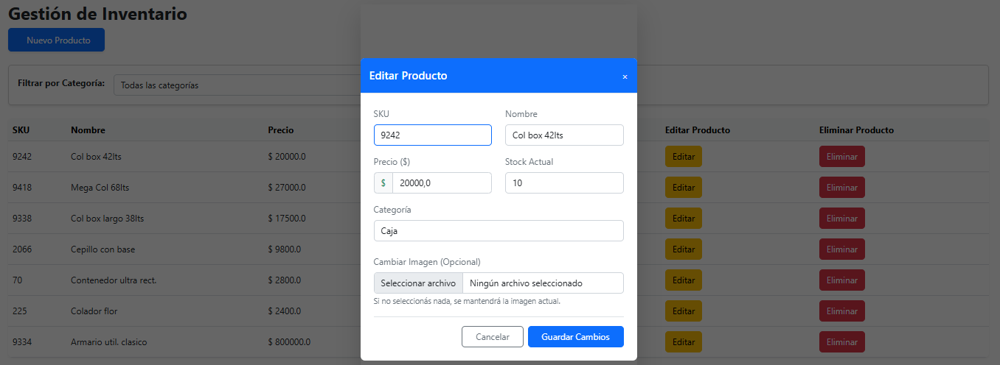
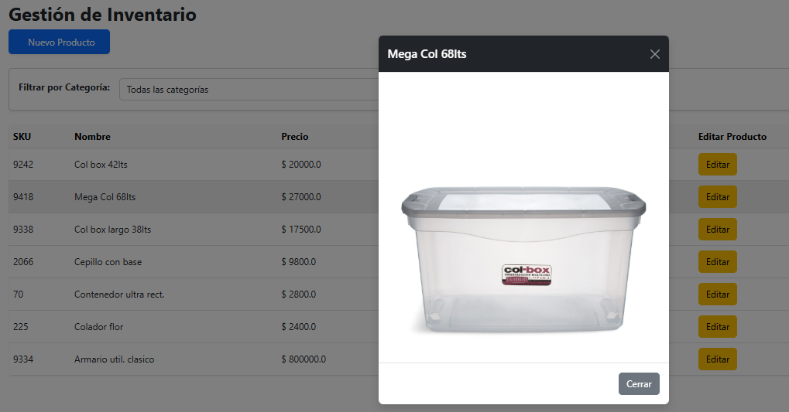

# Sistema de Gestión de Inventario Comercial

Aplicación web Backend modular desarrollada bajo la arquitectura MVC (Modelo-Vista-Controlador), diseñada específicamente para el control de stock, catalogación y administración de productos comerciales en tiempo real.

## 📸 Capturas de Pantalla 📸

### 📸 Agregar nuevo Producto

### 📸 Lista de Productos existentes

### 📸 Editar un Producto

### 📸 Visualizar Imagen

*(Nota: Asegurate de que el nombre del archivo de la imagen coincida con el que subas a tu repositorio)*

## Funcionalidades Clave
- **CRUD Completo:** Alta, baja, modificación y consulta de productos comerciales de manera dinámica.
- **Filtrado Avanzado:** Búsqueda y filtrado de productos por categoría optimizado directamente desde el backend.
- **Control de Stock Crítico:** Alertas visuales condicionales integradas en la interfaz para identificar productos con bajo inventario.
- **Gestión Multimedia:** Asociación, persistencia y visualización de imágenes para cada producto del catálogo.

## Tecnologías y Herramientas Utilizadas
- **Backend:** Java, Spring, Hibernate / JPA.
- **Base de Datos:** MySQL.
- **Frontend / Vistas:** Thymeleaf, HTML5, CSS3, Bootstrap.
- **Gestión de Dependencias:** Maven.
- **Control de Versiones:** Git / GitHub.

## Estructura del Proyecto
El proyecto sigue las mejores prácticas de estructuración para el ecosistema Spring:
- `Controller`: Manejo de rutas y peticiones web.
- `Service`: Lógica de negocio y servicios de la aplicación.
- `Repository`: Interconexión con la base de datos mediante Spring Data / Hibernate.
- `Model`: Definición de las entidades del sistema.
